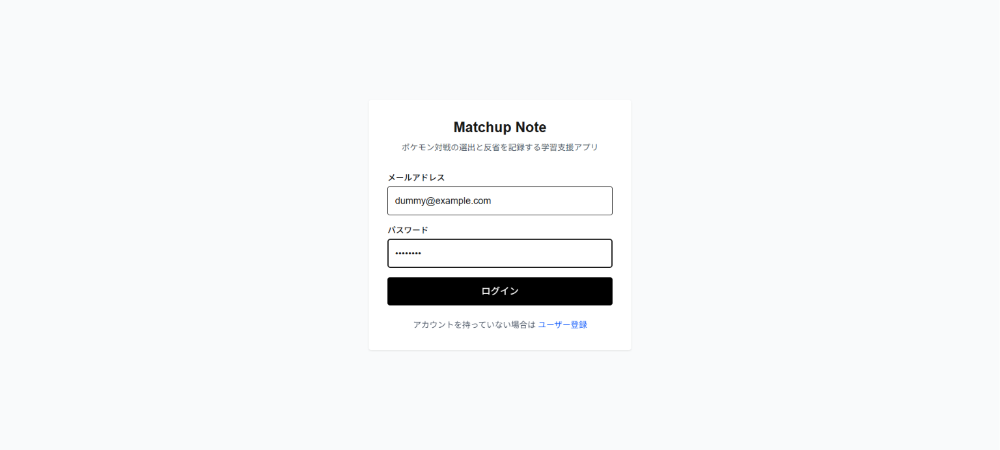
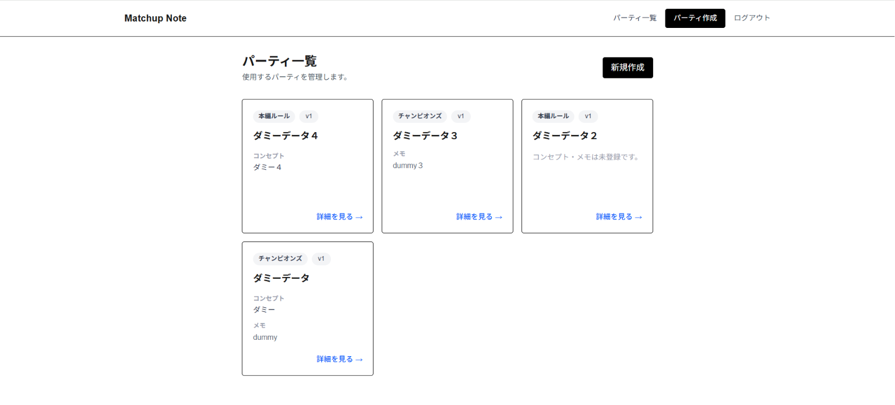
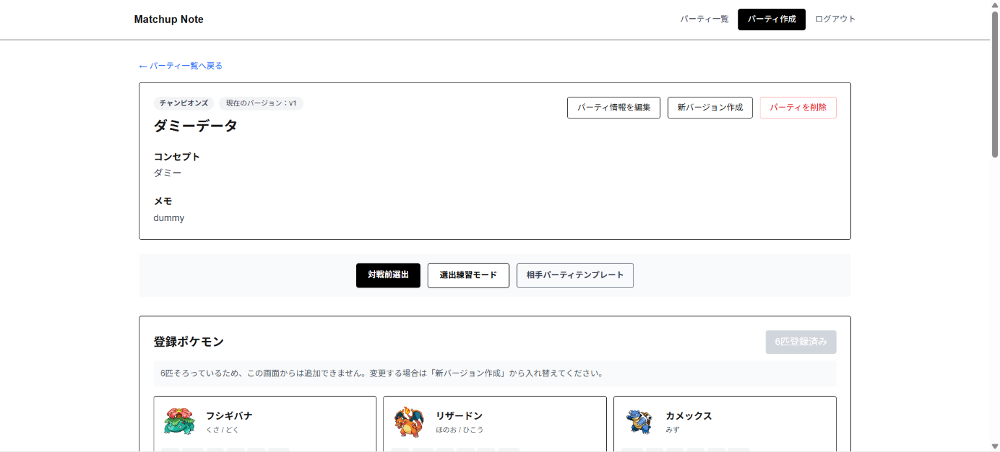
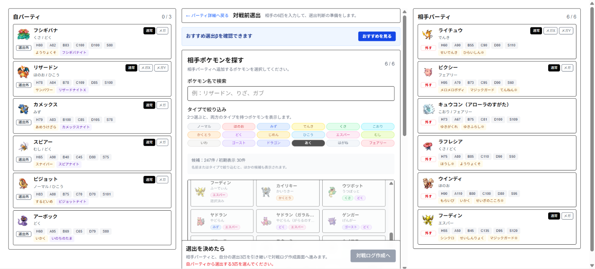
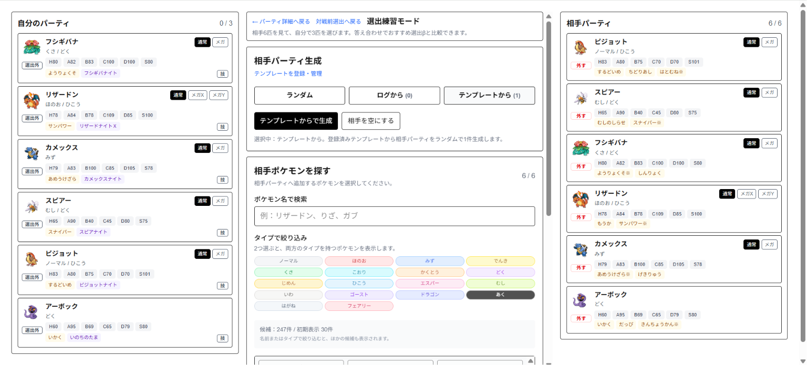
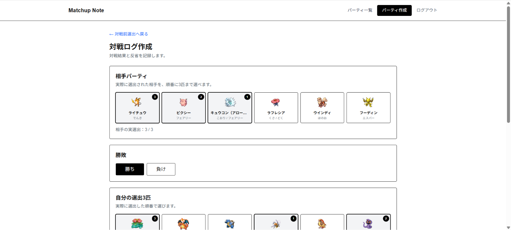
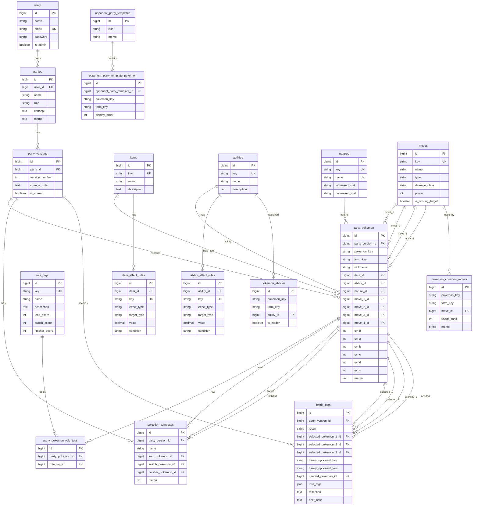

# Matchup Note

ポケモン対戦のパーティ構築、選出判断、対戦ログ、振り返りを一元管理する学習支援アプリです。

相手パーティを見ながら対戦前の選出を考え、対戦後に勝敗・選出・反省点を記録できます。パーティの変更履歴をバージョンとして残しながら、現在の構築の集計と、パーティ全体の総合集計を確認できるようにしています。

## 開発背景

ポケモンのランクマッチで勝ちを重ね、まずは初心者にとって大きな目標となるマスターボール級を目指したい、という自身の課題感から開発しました。

特に初心者のうちは、相手パーティを見たときに「何を選出すればよいか」が分からず、対戦したい気持ちはあっても手が止まりやすいと感じました。Matchup Noteでは、選出判断と対戦後の振り返りを記録しやすくすることで、同じような初心者から中級者手前のユーザーがランクマッチをより楽しみながら上達できることを目指しています。

メモや表計算ソフトでも記録はできますが、パーティ変更、選出テンプレート、対戦ログ、振り返りを別々に管理すると見返しづらくなります。そこで、対戦前後の判断をひとつの流れで残せるアプリとして Matchup Note を作成しました。

## 画面イメージ

| ログイン | パーティ一覧 |
| --- | --- |
|  |  |

| パーティ詳細 | 対戦前選出 |
| --- | --- |
|  |  |

| 選出練習 | 対戦ログ作成 |
| --- | --- |
|  |  |

## 主な機能

- ユーザー登録、ログイン、ログアウト
- パーティの作成、編集、削除
- パーティ内ポケモンの登録
- 技、特性、持ち物、性格、努力値、役割タグ、メモの管理
- パーティのバージョン管理
- 基本選出テンプレートの登録、編集、削除
- 相手パーティを入力して選出判断を補助する対戦前選出
- 対戦ログをもとにした選出練習
- 対戦ログの作成、編集、削除
- 現在のパーティバージョンと、パーティ全体の対戦ログ集計
- よく選出する味方、重かった相手、必要だった味方、敗因タグの集計
- 相手パーティテンプレートの確認、管理
- ポケモン、技、特性、道具、性格などのマスタデータ参照
- 管理者ユーザーによる一部マスタデータ登録、削除

## こだわったポイント

- パーティを変更しても過去ログを失わないよう、パーティバージョン単位でデータを管理
- 現在の構築だけの集計と、パーティ全体の総合集計を分けて表示
- 対戦ログから選出練習を生成し、振り返りをクイズ感覚で行える導線を作成
- ポケモンのタイプ、技タイプ、特性、持ち物を見ながら対戦前の選出を検討できるUIを作成
- 一般ユーザーと管理者ユーザーを分け、管理者向けの登録機能を制御

## 使用技術

### フロントエンド

| 技術 | 用途 |
| --- | --- |
| Next.js 16 | フロントエンドフレームワーク |
| React 19 | UI構築 |
| TypeScript | 型安全な実装 |
| Tailwind CSS 4 | スタイリング |
| Axios | API通信 |

### バックエンド

| 技術 | 用途 |
| --- | --- |
| PHP 8.4 | バックエンド実装 |
| Laravel 13 | API実装 |
| Laravel Sanctum | Cookieベースの認証 |
| SQLite | 開発環境のデータベース |
| PHPUnit | バックエンドテスト |

### 開発環境

- Node.js
- npm
- Composer
- Laravel Sail

## 技術スタック補足

`axios` はフロントエンドのAPI通信で使用しています。

データベースは `.env.example` と `config/database.php` のデフォルトが `sqlite` になっているため、READMEではSQLiteを開発環境のデータベースとして記載しています。Laravelの設定上はMySQLにも切り替え可能ですが、初期セットアップではSQLiteを前提にしています。

## ディレクトリ構成

```text
pokemon-note-app/
├── backend/                 # Laravel API
│   ├── app/
│   ├── database/
│   │   ├── migrations/
│   │   └── seeders/
│   └── routes/
└── frontend/                # Next.js frontend
    └── src/
        ├── app/             # App Router pages
        ├── components/      # 共通コンポーネント
        ├── features/        # 機能別モジュール
        ├── types/           # 型定義
        └── utils/           # 共通処理
```

## 環境構築

### 1. リポジトリをクローン

```bash
git clone https://github.com/lesser-fam/pokemon-note-app.git
cd pokemon-note-app
```

### 2. バックエンドのセットアップ

以下の環境を前提としています。

- PHP 8.4以上
- Composer
- PHP拡張: `intl`, `dom`, `xml`, `mbstring`

`composer install` が成功して `vendor/` が作成されてから、`php artisan` や `./vendor/bin/sail` を実行してください。

```bash
cd backend
composer install
cp .env.example .env
php artisan key:generate
```

SQLiteを使用するため、必要に応じてデータベースファイルを作成します。

```bash
touch database/database.sqlite
```

`.env` のDB設定を確認します。

```env
DB_CONNECTION=sqlite
```

フロントエンドとCookie認証を連携するため、ローカル開発では以下も設定します。

```env
APP_URL=http://localhost:8000
FRONTEND_URL=http://localhost:3000
SANCTUM_STATEFUL_DOMAINS=localhost:3000,127.0.0.1:3000
SESSION_DOMAIN=localhost
```

マイグレーションを実行します。

```bash
php artisan migrate
```

続けて、アプリで参照するマスターデータを作成・登録します。

```bash
php artisan app:setup-master-data
```

このコマンドでは、以下の処理をまとめて実行します。

- PokéAPIからポケモンの基本情報を取得し、`storage/app/data/pokemon.csv` を生成
- PokéAPIから技、特性、持ち物のマスターデータを取得し、DBへ登録
- `pokemon.csv` に含まれるポケモンと特性の紐付けを取得し、`storage/app/data/pokemon_abilities.csv` を生成
- シーダーを実行し、ユーザー、役割タグ、性格、特性補正、持ち物補正、ポケモンごとの特性、チャンピオンズ用のよく使われる技を登録

PokéAPIへ多数のリクエストを送るため、初回実行には時間がかかります。実際に全件取得した際は数十分かかる場合があります。Laravel Sailを使用する場合は、以下のように `sail artisan` で実行します。

```bash
./vendor/bin/sail artisan migrate
./vendor/bin/sail artisan app:setup-master-data
```

マスターデータ取得処理を個別に実行したい場合は、以下のコマンドも使用できます。

```bash
# ポケモン一覧CSVを生成
php artisan pokemon:export-csv --from=1 --to=1025 --output=pokemon.csv

# 技、特性、持ち物をDBへ登録
php artisan app:import-battle-master-data all

# ポケモンと特性の紐付けCSVを生成
php artisan pokemon:export-abilities-csv --output=pokemon_abilities.csv

# CSVや固定値をもとに初期データを登録
php artisan db:seed
```

### 3. フロントエンドのセットアップ

別ターミナルで実行します。

```bash
cd frontend
npm install
```

`frontend/.env.local` を作成し、APIの接続先を設定します。

```env
NEXT_PUBLIC_API_BASE_URL=http://localhost:8000
```

## 起動方法

### バックエンド

```bash
cd backend
php artisan serve
```

デフォルトでは `http://localhost:8000` で起動します。

### フロントエンド

```bash
cd frontend
npm run dev
```

デフォルトでは `http://localhost:3000` で起動します。

## デモアカウント

シーダーを実行すると、以下のテストユーザーが作成されます。

```text
一般ユーザー
メールアドレス: test@example.com
パスワード: password

管理者ユーザー
メールアドレス: admin@example.com
パスワード: password
```

## 確認コマンド

### フロントエンド

```bash
cd frontend
npm run lint
npx tsc --noEmit
```

### バックエンド

```bash
cd backend
composer test
```

## ER図

GitHub上で表示できるMermaid形式のER図です。



`pokemon_key` と `form_key` は、DB上の外部キーではなくポケモンマスタデータを参照するための識別子として使用しています。

## 要件定義・設計資料

- [要件定義書](docs/requirements.md)
- [設計書](docs/design.md)

## 今後の改善予定

- おすすめ選出ロジックの精度向上
- 主要機能のテスト追加
- 管理者向け機能の権限整理
- UIの細部調整
- デプロイ手順の整理
