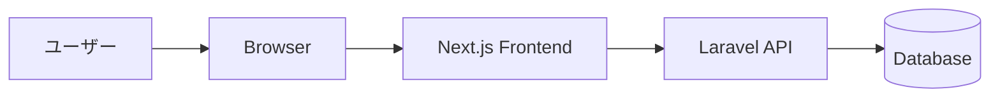
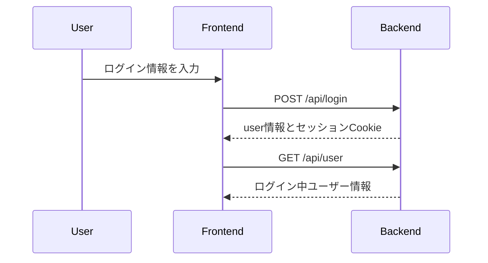
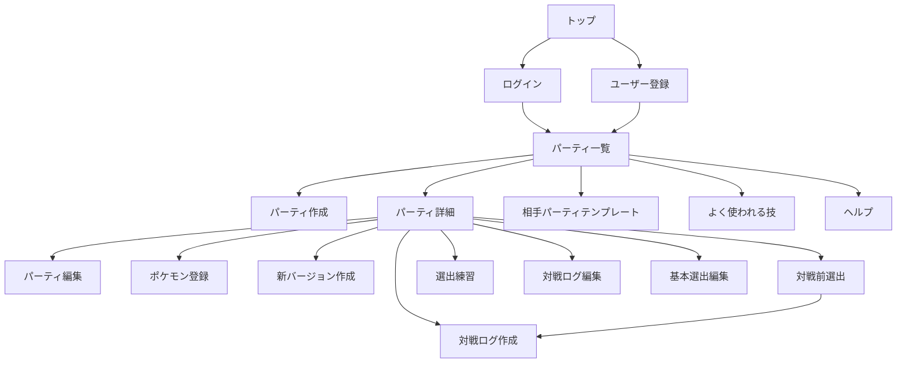

# 設計書

## 1. システム構成

Matchup Noteは、Next.jsのフロントエンドとLaravel APIのバックエンドで構成されています。



| レイヤー | 役割 |
| --- | --- |
| Frontend | 画面表示、入力フォーム、API通信、クライアント側の状態管理 |
| Backend | 認証、認可、バリデーション、データ永続化、集計に必要なデータ返却 |
| Database | ユーザー、パーティ、バージョン、ポケモン、対戦ログ、マスタデータの保存 |

## 2. ディレクトリ設計

```text
pokemon-note-app/
├── backend/
│   ├── app/
│   │   ├── Http/Controllers/Api/
│   │   ├── Http/Requests/
│   │   ├── Http/Resources/
│   │   ├── Models/
│   │   └── Services/
│   ├── database/
│   │   ├── migrations/
│   │   └── seeders/
│   ├── routes/
│   └── tests/
└── frontend/
    └── src/
        ├── app/
        ├── components/
        ├── features/
        ├── lib/
        ├── types/
        └── utils/
```

フロントエンドは `features/` 配下を機能単位で分割し、API通信、コンポーネント、hooks、utilsを近い場所にまとめています。

## 3. 認証・認可設計

- Laravel Sanctumを利用したCookieベースの認証を行う
- ログイン後、フロントエンドは `withCredentials` 付きのAxiosクライアントでAPIへアクセスする
- パーティ、パーティバージョン、対戦ログはログインユーザーの所有データのみ操作できる
- 管理者向けAPIは `admin` middlewareで制御する



## 4. 画面設計

| 画面 | パス | 主な役割 |
| --- | --- | --- |
| トップ | `/` | アプリ概要、使い方、新規登録・ログイン導線 |
| ログイン | `/login` | ログイン |
| ユーザー登録 | `/register` | 新規ユーザー登録 |
| パーティ一覧 | `/parties` | 自分のパーティ一覧表示 |
| パーティ作成 | `/parties/create` | パーティ新規作成 |
| パーティ詳細 | `/parties/[partyId]` | 登録ポケモン、選出テンプレート、対戦ログ集計、ログ一覧表示 |
| パーティ編集 | `/parties/[partyId]/edit` | パーティ名、ルール、コンセプト、メモ編集 |
| ポケモン登録 | `/parties/[partyId]/pokemon/create` | パーティ内ポケモン登録 |
| 新バージョン作成 | `/parties/[partyId]/versions/create` | 現在の構築をもとに新バージョン作成 |
| 対戦前選出 | `/parties/[partyId]/battle-preview` | 相手パーティ入力、相性確認、選出検討 |
| 選出練習 | `/parties/[partyId]/selection-practice` | 対戦ログをもとに選出練習 |
| 対戦ログ作成 | `/parties/[partyId]/battle-logs/create` | 対戦ログ新規作成 |
| 対戦ログ編集 | `/parties/[partyId]/battle-logs/[battleLogId]/edit` | 対戦ログ編集 |
| 相手パーティテンプレート | `/opponent-party-templates` | 相手パーティテンプレート管理 |
| よく使われる技管理 | `/common-moves` | よく使われる技の確認、管理者向けの登録・削除・CSVインポート |
| ヘルプ | `/help` | アプリの基本的な使い方を案内 |

## 5. 画面遷移



## 6. API設計

### 認証

| Method | Path | 説明 |
| --- | --- | --- |
| POST | `/api/register` | ユーザー登録 |
| POST | `/api/login` | ログイン |
| POST | `/api/logout` | ログアウト |
| GET | `/api/user` | ログイン中ユーザー取得 |

### パーティ

| Method | Path | 説明 |
| --- | --- | --- |
| GET | `/api/parties` | 自分のパーティ一覧取得 |
| POST | `/api/parties` | パーティ作成 |
| GET | `/api/parties/{party}` | パーティ詳細取得 |
| PUT | `/api/parties/{party}` | パーティ更新 |
| DELETE | `/api/parties/{party}` | パーティ削除 |

### パーティ内ポケモン・バージョン

| Method | Path | 説明 |
| --- | --- | --- |
| POST | `/api/party-versions/{partyVersion}/pokemon` | ポケモン登録 |
| DELETE | `/api/party-pokemon/{partyPokemon}` | ポケモン削除 |
| POST | `/api/party-versions/{partyVersion}/new-version` | 新バージョン作成 |

### 選出テンプレート

| Method | Path | 説明 |
| --- | --- | --- |
| POST | `/api/party-versions/{partyVersion}/selection-templates` | 基本選出登録 |
| PUT | `/api/selection-templates/{selectionTemplate}` | 基本選出更新 |
| DELETE | `/api/selection-templates/{selectionTemplate}` | 基本選出削除 |

### 対戦ログ

| Method | Path | 説明 |
| --- | --- | --- |
| POST | `/api/party-versions/{partyVersion}/battle-logs` | 対戦ログ作成 |
| PUT | `/api/battle-logs/{battleLog}` | 対戦ログ更新 |
| DELETE | `/api/battle-logs/{battleLog}` | 対戦ログ削除 |

### マスタデータ・管理者機能

| Method | Path | 説明 |
| --- | --- | --- |
| GET | `/api/pokemon` | ポケモン一覧取得 |
| GET | `/api/role-tags` | 役割タグ一覧取得 |
| GET | `/api/moves` | 技一覧取得 |
| GET | `/api/abilities` | 特性一覧取得 |
| GET | `/api/items` | 持ち物一覧取得 |
| GET | `/api/natures` | 性格一覧取得 |
| GET | `/api/pokemon-ability-warnings` | ポケモンごとの特性候補取得 |
| GET | `/api/pokemon-common-moves` | よく使われる技取得 |
| POST | `/api/pokemon-common-moves` | よく使われる技登録 管理者のみ |
| POST | `/api/pokemon-common-moves/import` | よく使われる技CSVインポート 管理者のみ |
| DELETE | `/api/pokemon-common-moves/{pokemonCommonMove}` | よく使われる技削除 管理者のみ |
| GET | `/api/opponent-party-templates` | 相手パーティテンプレート一覧取得 |
| POST | `/api/opponent-party-templates` | 相手パーティテンプレート登録 管理者のみ |
| DELETE | `/api/opponent-party-templates/{opponentPartyTemplate}` | 相手パーティテンプレート削除 管理者のみ |

## 7. データ設計

詳細なER図はREADMEの「ER図」を参照します。

主要な設計方針は以下です。

- `users` は複数の `parties` を所有する
- `parties` は複数の `party_versions` を持つ
- `party_versions` ごとに `party_pokemon`、`selection_templates`、`battle_logs` を管理する
- パーティ変更時は新しい `party_versions` を作成し、過去バージョンのログを保持する
- `battle_logs` は自分の選出、相手パーティ、相手選出、反省情報を保存する
- `pokemon_key` と `form_key` はDB外のポケモンマスタ識別子として扱う
- ポケモン一覧は `storage/app/data/pokemon.csv` を参照し、技・特性・持ち物はPokéAPIからDBへ取り込む
- よく使われる技は `pokemon_common_moves` にルール別で保存し、チャンピオンズ用CSVからSeederで登録する

## 8. バリデーション・制約

| 対象 | 制約 |
| --- | --- |
| パーティ | 自分のパーティのみ閲覧・編集・削除可能 |
| パーティ内ポケモン | 1パーティ内の上限数を制御 |
| パーティ内ポケモン | 同じ種類のポケモンは重複登録不可 |
| 努力値 | ルールごとに合計値・単体値の上限を検証 |
| 対戦ログ | 同じ味方ポケモンを複数選出枠に登録不可 |
| 対戦ログ | 別パーティバージョンのポケモンを登録不可 |
| 対戦ログ | 相手選出は相手パーティに存在するポケモンのみ登録可能 |
| 管理者API | `is_admin` が true のユーザーのみ実行可能 |
| マスタ検索 | 技、特性、持ち物はひらがな・カタカナの入力揺れを吸収して検索可能 |

## 9. テスト設計

Feature Testで以下を確認しています。

- 認証APIの登録、ログイン、ログアウト、未ログイン拒否
- パーティ作成時の初期バージョン作成
- 他ユーザーのパーティ閲覧不可
- 対戦ログ作成
- 同じ味方ポケモンの重複選出拒否
- 別パーティバージョンのポケモン利用拒否
- 一般ユーザーの管理者API利用拒否
- 管理者ユーザーの相手パーティテンプレート登録
- よく使われる技のルール別取得、CSVインポート権限
- 技、特性、持ち物のカナ揺れ検索

## 10. 今後の設計改善

- 対戦前選出のおすすめ選出ロジックの精度改善
- フロントエンドの画面単位テスト追加
- 画面単位のE2Eテスト追加
- デプロイ構成の設計
- 本番運用時のログ・監視設計
